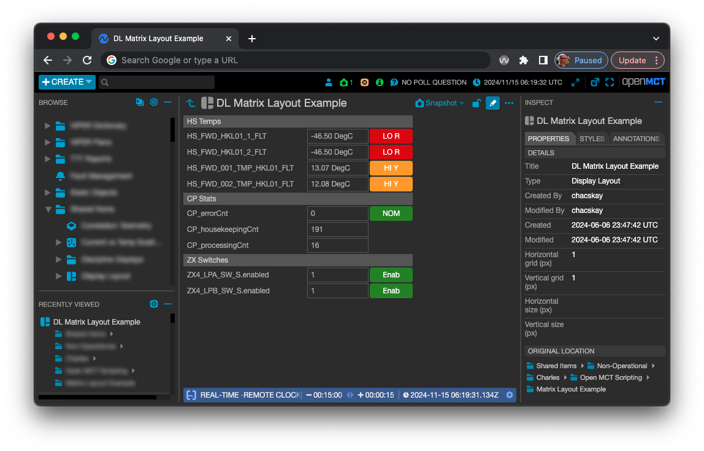
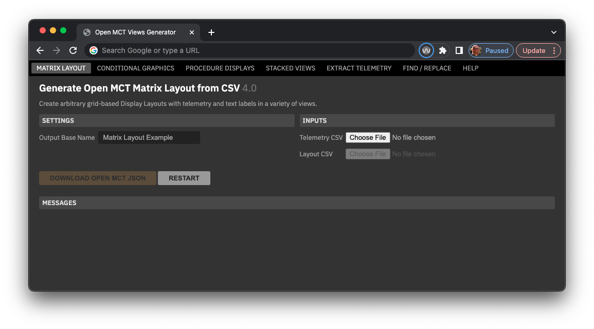
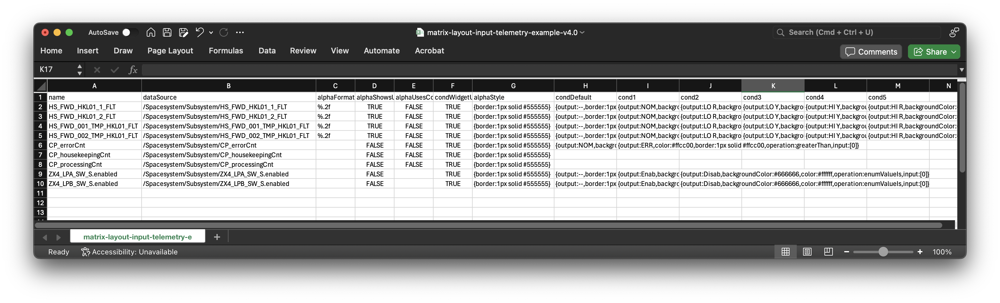
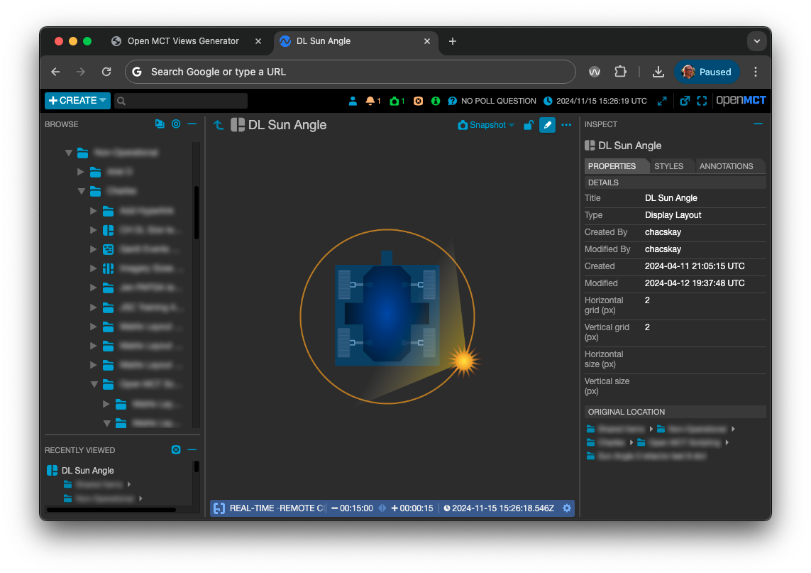

# Open MCT Scripting Tool

Last updated: 12 Apr 2024

- [Overview](#OpenMCTScriptingTool-Overview)
- [Links](#OpenMCTScriptingTool-Links)
- [Capabilities](#OpenMCTScriptingTool-Capabilities)
    - [Matrix Layout](#OpenMCTScriptingTool-MatrixLayout)
        - [What it does](#OpenMCTScriptingTool-Whatitdoes)
        - [Interface](#OpenMCTScriptingTool-Interface)
        - [CSV Input files common capabilities](#OpenMCTScriptingTool-CSVInputfilescommo)
        - [Matrix Layout telemetry CSV input file](#OpenMCTScriptingTool-MatrixLayoutteleme)
        - [Matrix Layout "layout" CSV input file](#OpenMCTScriptingTool-MatrixLayout"layou)
        - [Generated Open MCT Examples](#OpenMCTScriptingTool-GeneratedOpenMCTEx)
        - [Source](#OpenMCTScriptingTool-Source)
    - [Conditional Graphics](#OpenMCTScriptingTool-ConditionalGraphic)
        - [What it does](#OpenMCTScriptingTool-Whatitdoes.1)
        - [Interface](#OpenMCTScriptingTool-Interface.1)
        - [Input CSV file](#OpenMCTScriptingTool-InputCSVfile)
        - [Source](#OpenMCTScriptingTool-Source.1)
    - [Procedure Displays](#OpenMCTScriptingTool-ProcedureDisplays)
        - [What it does](#OpenMCTScriptingTool-Whatitdoes.2)
        - [Interface](#OpenMCTScriptingTool-Interface.2)
        - [Generated Examples](#OpenMCTScriptingTool-GeneratedExamples)
    - [Stacked Views](#OpenMCTScriptingTool-StackedViews)
        - [What it does](#OpenMCTScriptingTool-Whatitdoes.3)
        - [Interface](#OpenMCTScriptingTool-Interface.3)
        - [Generated Examples](#OpenMCTScriptingTool-GeneratedExamples.)
        - [Source](#OpenMCTScriptingTool-Source.2)
    - [Extract Telemetry](#OpenMCTScriptingTool-ExtractTelemetry)
        - [What it does](#OpenMCTScriptingTool-Whatitdoes.4)
        - [Interface](#OpenMCTScriptingTool-Interface.4)
        - [Generated Example](#OpenMCTScriptingTool-GeneratedExample)
- [Notes/Todos](#OpenMCTScriptingTool-Notes/Todos)

# Overview

Allows large scale creation of a variety of Open MCT views, many with integrated Conditional styling. Source files include tabular CSV, PRIDE .prl files, and Python ground control scripts (GCS). The tool outputs JSON files that are imported into Open MCT.

1. Create and/or gather input files.
2. Run those inputs through this tool, which then outputs an Open MCT import-ready JSON file.
3. Import that JSON file into Open MCT in the environment and location desired.

The tool also provides a capability to extract telemetry paths from GCS scripts and PRIDE PRL files into a CSV output.

# Links
- Release notes and change history: [Open MCT Scripting Tool Release Notes](documentation/release-notes.md)
- Online web tool:  <https://charlesh88.github.io/openmct-scripting/>
- Code repo: <https://github.com/charlesh88/openmct-scripting>

# Capabilities
## Matrix Layout
### What It Does

- Uses two input CSV files, one for telemetry and conditions and the other for layout and creates a single Display Layout as a result.
    - The layout can display telemetry elements in the source file as alphanumerics or widgets, depending on the specification in the matrix layout CSV file.
    - The matrix layout defines a grid with variable column widths and row heights.
    - Each telemetry element can be conditionally styled.
    - Static layout text elements can be added as labels; labels can span multiple columns.
- Creates Condition Sets for each specified row in the source file which are used by elements in the Display Layout.
- Folders that contain the above elements.

### Interface

- **Output Base Name**: defines the base of names used to define output JSON files.
- **Telemetry CSV Input**: a CSV file that defines paths to telemetry parameters, properties and condition properties.
- **Layout CSV**: a CSV file that defines column widths, row heights, paths to telemetry parameters and text labels.

### CSV Input Files Common Capabilities

#### Escaping Text in the Input Files

The tool uses certain special characters (commas, tildes and backslashes) to separate arguments and define telemetry paths - these characters can't be used in text labels without being escaped. To use these characters for text, they must be escaped with a forward slash "\\" as shown below.

| **Character** | **Format** | **Example** | **Resulting Display** |
| --- | --- | --- | --- |
| Comma | \\, | STATE (A\\, F == Arm\\, Fire) | STATE (A, F == Arm, Fire) |
| Tilde | \\~ | TEMP \\~10 - 20 deg | TEMP ~10 - 20 deg |
| Backslash | \\/ | Use \\/ViperGround\\/KLMIO | Use /ViperGround/KLMIO |

### Matrix Layout Telemetry CSV Input File

This file defines the telemetry points and associated Condition Sets to be used in the matrix Display Layout. When the condition cells (columns G and on) are populated for a row, a Condition Set will be created that incorporates and evaluates the telemetry parameter in column B "dataSource".

Row 1 must be these headers:

- **name:** name of the parameter; used by generated Condition Widgets. See below for more.
- **dataSource:** full path for the parameter using forward-slashes to denote containers and periods for aggregates, like: "/SpacecraftSystem/Subsystem/folder/aggregate.parameterName". Can be copied directly from Yamcs or other mission spec documents.
- **alphaFormat:** a printf string to be applied to numeric alphanumerics in a Display Layout. For example, "%.2f" will round a numeric parameter to two decimal points.
- **alphaShowsUnit:** either TRUE or FALSE to indicate if alphanumerics should include units when they are available.
- **alphaUsesCond:** either TRUE or FALSE to indicate if the resulting alphanumeric should use a Condition Set and conditional styling. If TRUE, then at least one condition must be specified in the table; see below for more.
- **condWidgetUsesOutputAsLabel:** either TRUE or FALSE to indicate if generated Condition Widgets should use a generated Condition Set output string as a label. For example, a switch state widget could spec conditions that output "ON" and "OFF" and setting this to TRUE would cause the widget to display that text when the relevant conditions are matched. Settiing to FALSE will use the "name" property specified in that column.
- **condDefault:** properties and styles for the Default condition in the row's Condition Set.
- **cond1 through cond10:** styles and evaluation properties for up to ten Conditions in a Condition Set.
    - Headers must be named exactly as "cond1, cond2", etc.
    - Not every row must have a condition definition, but a header for a column for which there is a condition defined. For example, if 99 of 100 rows only use two condition definitions, but a single row uses three conditions, the CSV must include headers for "cond1", "cond2" and "cond3".
    - Each cell entry is style properties and a single criteria that evaluates the telemetry parameter in Column B, organized like this:
        - **Condition output**: when the Condition matches, the Condition set can output a string, which can be used and displayed by a Condition Widget. The value here defines that string.
        - **Background color:** the background color to be applied for matching Conditions when using Conditional styling.
        - **Foreground color:** the foreground color to be applied for matching Conditions when using Conditional styling.
        - **Match criteria:** use "any" to match the defined Condition operation and Comparison input; use "not" to match all values not defined in the Condition operation and Comparison input.
            - For example: given float telem X with a current value of 0.2:
        - **Condition operation**: the operation to perform against telemetry values, e.g. equalTo, greaterThan, etc. See "Defining Conditions in the Telemetry CSV" below.
        - **Comparison value(s)**: what to compare the Condition evaluation to. Not all Condition evaluations have comparison values. See "Defining Conditions in the Telemetry CSV" below.

#### Defining Conditions in the Telemetry CSV

| **Telemetry Type** | **Operation** | **Description** | **Condition operation literals** | **Comparison input format** | **Example** | **Notes** |
| --- | --- | --- | --- | --- | --- | --- |
| All | Is Defined | Matches if the telemetry endpoint is present and available from Yamcs, even when it doesn't have a value. | isDefined, isUndefined | No comparison value | N/A |     |
| All | Data older than |     | isStale | Number of milliseconds | 1500 |     |
| Float | Equality | Compares a current telemetry value to the Comparison value with equality. | equalTo | Single number | 100 | Note that Float and Integer telemetry types and comparisons are not compatible, i.e. a telem value of 0.000 will not match a comparison value of 0. Use Greater/less than comparisons in these cases. |
| Float | Greater/less than |     | greaterThan, lessThan, greaterThanOrEq, lessThanOrEq | Single number | 100 |     |
| Float | Between |     | between, notBetween | Two numbers separated by a comma | \-100,100 |     |
| Enumeration | Enum value equality |     | enumValueIs, enumValueIsNot | Raw numeric of the enumeration, not the enumeration string | 1   |     |
| String | Contains |     | textContains, textDoesNotContain | Text | ooba |     |
| String | Starts/Ends |     | textStartsWith, textEndsWith, | Text | Foo |     |
| String | Equality |     | textIsExactly | Text | Foobar |     |

#### Condition Examples

| **Telemetry Type** | **Goal** | **Condition string** |
| --- | --- | --- |
| All | If the telemetry is present on the server, output the string "Defined" with a medium gray background and white foreground. | Defined,#666666,#ffffff,any,isDefined |
| Numeric | If the current float telemetry value is between than -0.1 and 0.2, output the string "Nominal" with an green background and white foreground. | Nominal,#006600,#ffffff,any,between,-0.1,0.2 |
| Numeric | If the current float telemetry value is greater than 0.2, output the string "High" with an orange background and white foreground. | High,#ff6600,#ffffff,any,greaterThan,0.2 |

### Matrix Layout "layout" CSV Input File

The matrix layout is simply a grid with variable column widths and row heights.

- Row 1 defines the width of columns in the grid, in layout grid units.
- Column A defines the height of each row in the grid, in layout grid units.
- Cell A1 contains 3 comma-separated values that control the grid dimensions and item margin:
    - The first two values are the desired layout grid dimensions, which are the basis for grid units.
    - The last value is the amount of margin between columns and rows, in grid units.
    - For example, "1, 1, 4" will create a Display Layout with settings of grid X =  1, grid Y = 1, and 4 "grid units" of margin between columns and rows.
    - If values are not provided in A1, the tool will use the default settings of 1, 1, 4.
- Cells can contain text, or a path to a telemetry parameter.
    - Text cells can contain optional "flags"; see below for more.
    - Cells that start with "/" or "~" will be treated as parameter paths.
    - You can use "/" or "~" if they are escaped, see notes above.
- Your telemetry file can include parameters that are not used by the layout file, but the converse is not true: parameters used in this file MUST be present in the telemetry CSV file used for a given matrix layout.

The resulting matrix layout output based on the CSV input above:

#### Using Optional Flags in the Layout CSV File

Both text and telemetry parameters accept certain "flag" arguments that allow additional capabilities and rendering options. More than one flag can be used at a time, separated with commas. Flags include:

| **Capability** | **Flag** | **Telemetry** | **Text** | **Example**                                                  | **Notes** |
| --- | --- |---------------|---|--------------------------------------------------------------| --- |
| Span multiple columns | \_span(#) | YES           | YES   | SYSTEMS,**\_span(3)**                                        | A text element with "SYSTEMS" will span across the designated number of columns, starting at the element's current column. |
| Render as Condition Widget | \_cw | YES        |          | /SpacecraftSystem/Subsystem/aggregate.parameterName,**\_cw** | Renders a Condition Widget for this telemetry parameter. If this parameter is set to use Conditions in the telemetry CSV input file, then a Condition Set will be created using those parameters. |
| Render as Hyperlink button | \_link(url) |               | YES   | BUTTON LABEL,**\_link(https://someurl.com)**                 | A text element rendered as a Hyperlink button. Clicking the button will open the designated URL in a new browser tab. Note that Open MCT only accepts valid nasa.gov URLs. Note that elements with this flag cannot be styled with \_bg and \_fg; see below. |
| Style background color | \_bg(hex value) |               | YES   | BUTTON LABEL,**\_bg(#666666)**                               | Color must be specified as full hex values. Only applicable to text elements that are not Hyperlink buttons. Resource for getting hex values: [hex+color+picker](https://www.google.com/search?q=hex+color+picker) |
| Style foreground color | \_fg(hex value) |               | YES   | BUTTON LABEL,**\_fg(#000099)**                               | Color must be specified as full hex values. Only applicable to text elements that are not Hyperlink buttons. |

### Generated Open MCT Examples

### Source

- Telemetry CSV: [Matrix Layout inputs Telemetry CSV example](documentation/files/matrix-layout-input-telemetry-example.csv)
- Matrix Layout CSV: [Matrix Layout inputs Layout CSV example](documentation/files/matrix-layout-input-layout-example.csv)

## Conditional Graphics

Generates one or more "image view" objects within a Display Layout. Image views can be conditionally styled to show a given image source when a condition in a Condition Set is matched. This example uses a sun angle telemetry parameter to display one of 23 different images of the "sun" graphic, overlaid on a base drawing of the rover, itself its own image view object.

### What It Does

- Generates one or more "image view" objects within a single Display Layout.
    - Source images must all be the same size for all image views in the layout.
    - Image views color and border styling can be defined.
- Optionally generates one Condition Set.
    - The number of conditions in the set is not limited.
    - Each condition evaluates only one criteria.
- Data sources can be dictionary parameters or a Sine Wave Generator.
    - If a generator is specified, the tool will create one or more generators as a result.

### Interface

<!--IMAGE HERE-->

- **Output Base Name**: defines the base of names used to define output JSON files.
- **Display Layout Grid**: the X and Y grid dimensions to be used by generated Display Layouts.
    - Settings here are per pixel and define the scale of item widths and heights specified elsewhere. For example, using a grid of 2,2 would create a 2 x 2 grid in the layout. Items set to 200 width and 14 high would then be 400 pixels wide by 28 pixels high.
    - Using smaller numbers here mean that items can be more tightly packed. Using a grid of 1,1 would make the grid equivalent to pixels.
- **Image size in px:** the pixel size (not grid units) desired for the resulting image view. All generated image views will be the same size in the Display Layout.

### Input CSV file

Example input using telemetry paths as a data source:
<!--IMAGE HERE-->

Example input using a Sine Wave Generator as a data source:
<!--IMAGE HERE-->

Row 1 must be these headers:
- **imageViewName**: The name of the image view object that will be created within the layout.
    - Names must be unique in the sheet. Entering a different name creates a separate image with its own set of conditional styling, if set.
    - To apply a set of conditions to a single image view, use the same name in each row.
    - Image views are always the same dimensions, set in "Image size in px" in the web app interface.
- **dataSource**: a valid path to a telemetry source, a definition for a Sine Wave Generator or a name reference to a generator specced in a previous row. See notes below on Sine Wave Generators.
- **isDefault**: optional boolean if the condition for this row should be a default. If no default is specified, the Condition Set will create an unnamed default condition.
- **operation**: The condition operation to be performed for this row. See [Defining Conditions in the Telemetry CSV](#OpenMCTScriptingTool-ConditionOperation) above.
- **input**: Nothing, string, single number, or two numbers to be used as the condition operation evaluators. See [Defining Conditions in the Telemetry CSV](#OpenMCTScriptingTool-ConditionOperation) above.
- **name**: The name of the condition that will be created for this row.
- **output**: The output string of the condition that will be created for this row.
- **bgColor, fgColor, border**: See [Defining Conditions in the Telemetry CSV](#OpenMCTScriptingTool-ConditionOperation) above.
- **imageUrl**: a full path to an image source file. Note that Open MCT for VIPER only supports URLs within the nasa.gov domain.

### Source

- Example using dictionary telemetry parameters: [Sun Angle dictionary input example.csv](documentation/files/conditional-graphics-example-sun-angle.csv)
- Example that uses a generated Open MCT Sine Wave Generator: [Sun Angle 3 SWG input.csv](documentation/files/conditional-graphics-example-sun-angle-swg.csv)

## Procedure Displays

### What It Does

- Traverses multiple PRIDE procedure .prl files and creates Display Layout of alphanumeric parameter values and Stacked Plots for each.
    - Parameters are grouped into their steps and labeled as such.
    - Each parameter is included as an alphanumeric with a label derived from the procedure file.
    - Widths of alphanumerics can be directly set; the width of labels is automatically calculated.
    - **IMPORTANT NOTE**: only fully qualified paths (e.g. '/SpacecraftSystem/Subsystem/etc.') in procedures can be found and extracted; references without in descriptive text may not be found.
- A Tabs View that contains all the generated Display Layouts.
- A Stacked Plot per procedure with parameters used.
- Folders that contain the above elements.

### Interface

<!--IMAGE HERE-->

- **Output Base Name**: defines the base of names used to define output JSON files.
- **Display Layout Grid**: the X and Y grid dimensions to be used by generated Display Layouts.
    - Settings here are per pixel and define the scale of item widths and heights specified elsewhere. For example, using a grid of 2,2 would create a 2 x 2 grid in the layout. Items set to 200 width and 14 high would then be 400 pixels wide by 28 pixels high.
    - Using smaller numbers here mean that items can be more tightly packed. Using a grid of 1,1 would make the grid equivalent to pixels.
- **Item Margin**: a single grid unit number that controls the amount of horizontal and vertical space between items in the Display Layout. Using "1" with grid set to 2,2 would create a 2 x 2 pixel space between labels and elements.
- **Alphanumeric Width:** controls the width of alphanumeric elements in the layout.
- **Row Height**: controls the height of text-plus-alphanumeric pairs in the layout.

## Stacked Views

<!--IMAGE HERE-->

### What It Does

- Takes in multiple telemetry source files and creates both a Stacked Plot and a Flexible Layout for each.
- The source file can group telemetry parameters into Overlay Plots, which become elements within the Stacked Plots and Flexible Layouts.
    - Overlay Plots of the same name will be created once, and shared amongst multiple Stacked Plots and Flexible Layouts.
    - Telemetry parameters can specify some properties like the display of limit lines, marker size and shape, and line interpolation style.
- Folders that contain the above elements.

### Interface

<!--IMAGE HERE-->
- **Output Base Name**: defines the base of names used to define output JSON files.

### Example Source
- Example that creates 3 overlay plots in a Stacked View: [Stacked View example 1   .csv](documentation/files/stacked-view-input-example-1.csv)

## Extract Telemetry

### What It Does

- Takes in multiple source files and creates CSV file outputs. This is not an import-able Open MCT display, but is an aid to quickly generate lists of in-use parameters across multiple sources.
    - "Unique Telemetry" will simply generate a list of all unique parameters used across all the input files.
    - "Telemetry and Refs" will output a table with parameter paths, the file that contained them, and their reference context. For example, in a GCS parameters can be referenced in in getVal and checkVal functions, this output will indicate as such.
    - **IMPORTANT NOTE**: only fully qualified paths (e.g. '/SpacecraftSystem/Subsystem/etc.') in PRIDE procedure files can be found and extracted; references without in descriptive text may not be found.

### Interface

<!--IMAGE HERE-->
- **Output Base Name**: defines the base of names used to define output JSON files.
- **Input File Type**: choose either GCS Python scripts (.py) or PRIDE procedure (.prl).
